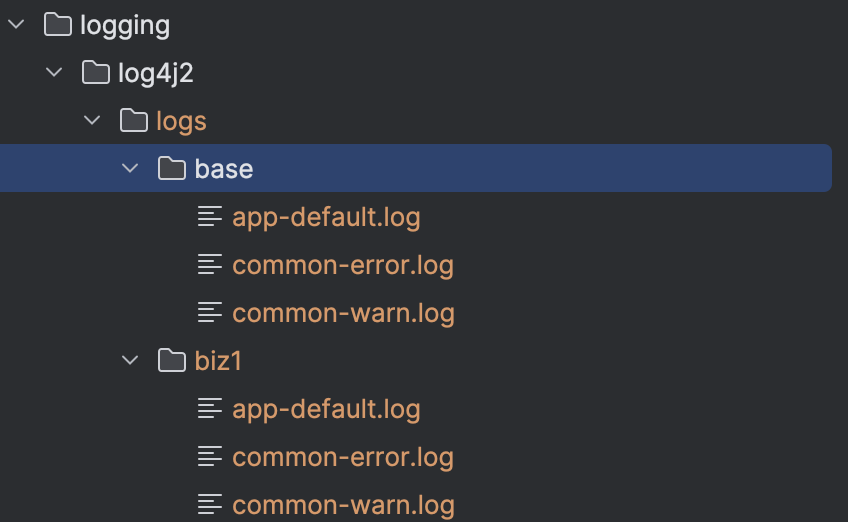

<div align="center">

English | [简体中文](./README-zh_CN.md)

</div>

# dynamically download log4j2 patch package, adapt to multi-application mode
check principle [here](https://github.com/koupleless/koupleless/blob/master/docs/content/zh-cn/docs/contribution-guidelines/runtime/logj42.md)

# Experiment
## Experiment application
### base
The base is built from regular SpringBoot application. The only change you need to do is to add the following dependencies in pom

```xml
<!-- Add dynamic module related dependencies here -->
<!--    Be sure to put this dependency as the first dependency in the build pom, and set type= pom,
    The principle can be found here https://koupleless.gitee.io/docs/contribution-guidelines/runtime/multi-app-padater/ -->
<dependency>
    <groupId>com.alipay.sofa.koupleless</groupId>
    <artifactId>koupleless-base-starter-beta</artifactId>
    <version>${koupleless.runtime.version}</version>
    <type>pom</type>
</dependency>
<!-- end of dynamic module related dependencies -->

<!-- Add dependencies for deploying multiple web applications in tomcat single host mode here -->
<dependency>
<groupId>com.alipay.sofa</groupId>
<artifactId>web-ark-plugin</artifactId>
</dependency>
<!-- end of dependencies for single host deployment -->

<!-- add log4j2 dependencies -->
<dependency>
    <groupId>org.springframework.boot</groupId>
    <artifactId>spring-boot-starter-log4j2</artifactId>
</dependency>

<!-- add log4j2 async queue dependencies -->
<dependency>
    <groupId>com.lmax</groupId>
    <artifactId>disruptor</artifactId>
    <version>${disruptor.version}</version>
</dependency>
<!-- end of log4j2 -->

```
To ensure that log4j2 is adapted to multi-application mode, that is, the logs of the module and the base are printed in different directories, we also need to add the corresponding patch package plugin to it.
To facilitate the use of users, we use a build plugin to dynamically download the patch package, and the plugin configuration is as follows:

```xml

<plugin>
    <groupId>com.alipay.sofa.koupleless</groupId>
    <artifactId>koupleless-base-package-plugin</artifactId>
    <version>${koupleless.runtime.version}</version>
    <executions>
        <execution>
            <goals>
                <goal>add-patch</goal>
            </goals>
        </execution>
    </executions>
</plugin>
```

### biz
The biz contains 1 modules. biz1 is a regular SpringBoot. The packaging plugin method is modified to the sofaArk biz module packaging method, packaged as an ark biz jar package, and the packaging plugin configuration is as follows:

```xml
<!-- change the packaging plugin to sofa-ark biz packaging plugin, packaged as ark biz jar -->
<plugin>
    <groupId>com.alipay.sofa</groupId>
    <artifactId>sofa-ark-maven-plugin</artifactId>
    <version>${sofa.ark.version}</version>
    <executions>
        <execution>
            <id>default-cli</id>
            <goals>
                <goal>repackage</goal>
            </goals>
        </execution>
    </executions>
    <configuration>
        <skipArkExecutable>true</skipArkExecutable>
        <outputDirectory>./target</outputDirectory>
        <bizName>${bizName}</bizName>
        <!-- single host mode, need to change web context path -->
        <webContextPath>${bizName}</webContextPath>
        <declaredMode>true</declaredMode>
    </configuration>
</plugin>
```
Note that the web context path of different biz is changed to different values, so that multiple web applications can be successfully installed in a tomcat host.

## Experiment Task
### run `mvn clean package -DskipTests`
we can check the ark-biz jar package in target directory of each bundle
meanwhile, we can find the log4j2 patch package in the target directory of the base

this proves that the patch package is successfully downloaded and copied to the target directory
### start base application, and make sure base start successfully
### execute curl command to install biz1 and biz2
```shell
curl --location --request POST 'localhost:1238/installBiz' \
--header 'Content-Type: application/json' \
--data '{
    "bizName": "biz1",
    "bizVersion": "0.0.1-SNAPSHOT",
    // local path should start with file://, alse support remote url which can be downloaded
    "bizUrl": "file:///path/to/springboot-samples/samples/web/tomcat/biz1/target/biz1-log4j2-0.0.1-SNAPSHOT-ark-biz.jar"
}'
```

### check whether the log print is split into different directories
1. check content 1, you can see the log when the module starts in the console under different directories.


## Precautions
Here mainly use simple applications for verification, if complex applications, need to pay attention to the module to do a good job of slimming, the base has dependencies, the module as much as possible set to provided, as much as possible to use the base dependencies.
